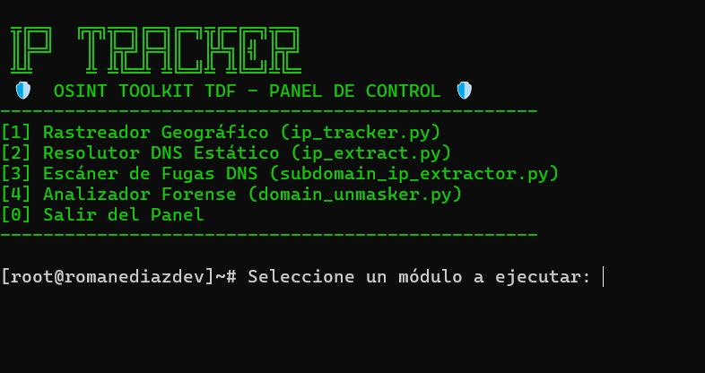

# OSINT Toolkit TDF 🛡️ - Prototipo de Auditoría de Red

Este repositorio contiene una suite de herramientas desarrolladas en **Python** enfocadas en la recolección de inteligencia de fuentes abiertas (OSINT) y el análisis de infraestructura de red. Este proyecto fue desarrollado como parte de mi formación técnica en el **Centro Politécnico Superior Malvinas Argentinas (Río Grande, Tierra del Fuego)**.

## 🎛️ Panel de Control Central
El toolkit incluye un menú interactivo (`panel_osint.py`) que funciona como el centro de operaciones. Desde este hub podés lanzar cualquiera de las herramientas forenses de manera ágil sin necesidad de ejecutar los scripts por separado.



## 🛠️ Herramientas Incluidas

El ecosistema se divide en cuatro módulos principales:

### 1. Rastreador Geográfico Avanzado (`ip_tracker.py`)
Módulo principal de geolocalización que consulta APIs de inteligencia para obtener datos precisos de una dirección IP.
* **Detección de Escudos:** Identifica automáticamente si la IP pertenece a un Proxy, VPN o a un centro de datos (Hosting) como Cloudflare o AWS.
* **Reportes Automáticos:** Genera un archivo `.txt` detallado con coordenadas GPS, ISP y organización, incluyendo advertencias de seguridad si la ubicación es potencialmente falsa.

### 2. Resolutor DNS Estático (`ip_extract.py`)
Herramienta fundamental para la fase de reconocimiento inicial.
* **Limpieza de Datos:** Utiliza manipulación de strings para procesar URLs crudas y extraer el dominio puro.
* **Resolución de Host:** Emplea la librería nativa `socket` para interrogar a los servidores DNS y obtener la IP pública de cualquier sitio web.

### 3. Escáner de Fugas DNS (`subdomain_ip_extractor.py`)
Diseñado específicamente para auditar y evadir protecciones de servicios de borde como Cloudflare.
* **Detección de Fugas:** Realiza un escaneo sobre subdominios comunes (`mail`, `ftp`, `dev`, etc.) para encontrar configuraciones incorrectas que expongan la IP real del servidor de origen.

### 4. Analizador Forense de Enlaces (`domain_unmasker.py`)
Herramienta de seguridad defensiva para analizar enlaces sospechosos o enmascarados.
* **Anti-Spoofing:** Sigue la cadena de redirecciones HTTP sin ejecutar scripts maliciosos en el equipo local del analista.
* **Identificación de Amenazas:** Detecta específicamente si el destino final es un servicio de IP Logging conocido (como Grabify o IPLogger).

## 🚀 Instalación y Uso

Este toolkit fue desarrollado utilizando únicamente **librerías nativas de Python 3.x**, por lo que no requiere la instalación de dependencias externas (`pip`). Es ideal para entornos de auditoría rápidos y portables.

1. Clonar o descargar el repositorio en tu equipo.
2. Abrir una terminal (PowerShell, CMD o Bash) en la carpeta del proyecto.
3. Iniciar el Panel de Control interactivo:
   ```bash
   python panel_osint.py

⚖️ Descargo de Responsabilidad (Disclaimer)
Esta herramienta tiene fines estrictamente educativos y de auditoría ética. El autor no se hace responsable del uso indebido de estos scripts. El escaneo o acceso a información de infraestructuras de terceros sin autorización previa es ilegal y va en contra de los principios de ciberseguridad ética.

Desarrollado en Río Grande, Tierra del Fuego, Argentina. 🇦🇷
